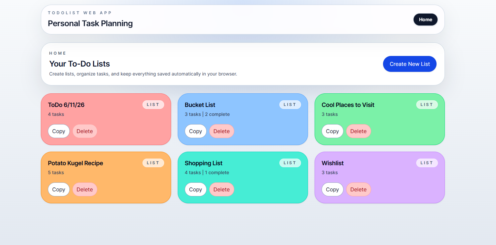

# ToDoList-WebApp

A client-side to-do list web app built with Vue 3, TypeScript, and Tailwind CSS. All data is saved automatically to browser Local Storage — no backend required.



## Features

- Create multiple named to-do lists, each with a custom background color
- Add, edit, delete, and reorder tasks with drag-and-drop
- Mark tasks as completed (strikethrough) or important (starred, pinned to top)
- Copy a full list as plain text to the clipboard
- All changes persist automatically — survives page refresh and browser restart

## Tech Stack

- **Vue 3** with Composition API and `<script setup>`
- **Vue Router** for client-side navigation between Home and List views
- **TypeScript** throughout
- **Tailwind CSS v4** for styling
- **vuedraggable** for drag-and-drop task ordering
- **Browser Local Storage** for persistence

## Running Locally

```bash
npm install
npm run dev
```

Then open the localhost link in your browser.

## Project Docs

- [`SPEC.md`](SPEC.md) — Full feature spec with data model, user stories, and acceptance criteria
- [`ADR.md`](ADR.md) — Architecture decision records with rationale and rejected alternatives
